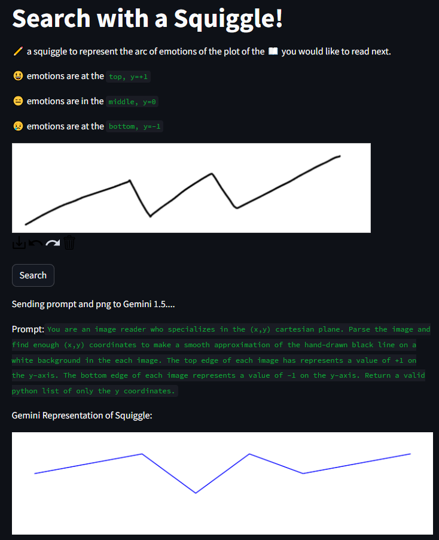
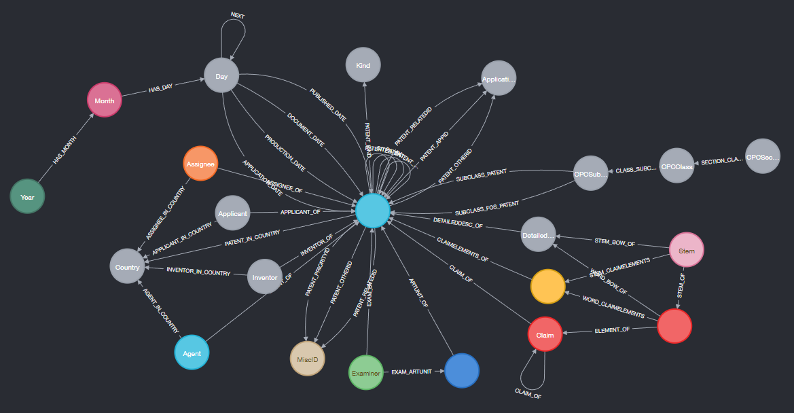
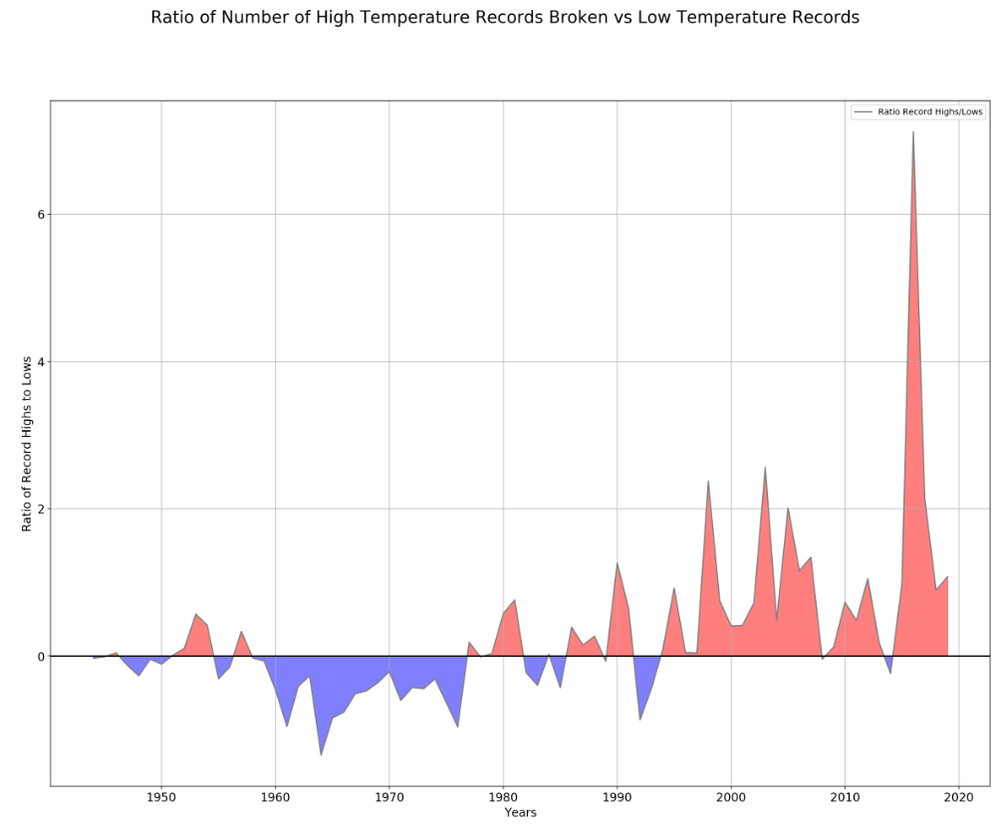

# Personal Projects :computer:

These are links/descriptions to personal projects.

---

## Gut-Emotions for MHacks
[](https://gut-emotions-mhacks.streamlit.app)
This is a [Streamlit app](https://gut-emotions-mhacks.streamlit.app) we made to compete in [MHacks 16](https://safe-banon-80d.notion.site/Hacker-Guide-079b584c6deb446e88c53712dc0f9ecb) in Ann Arbor. The goal was to use Google Gemini 1.5 and do something with generative AI, and Gemini's 1 million token context window. We loaded books from Gutenberg and had Gemini analyze them and return a series of emotions, as well as a ranking of that emotion. The next step was to draw a squiggle as search input to represent the emotional arc you would like to see in a book, and then return those books that are closest. We wanted Gemini to interpret the drawn squiggle, but it struggled, so we fell back on the PIL library. Source code is in [GitHub](https://github.com/legolego/GutEmotions)

---

## Patent search engine in Neo4j

This is the schema in a Neo4j graph database we created in order to make a search engine. ~one million patents were loaded locally from [USPTO bulk data files](https://developer.uspto.gov/product/patent-grant-full-text-dataxml).

---

## This Retype site
```c++
input: ./retype_src
output: C:/gitProjects/legolego.github.io
url: https://legolego.github.io/
cname: false

```
You can make this site yourself with [Retype](https://retype.com/), code is [here](https://github.com/legolego/retype_site). The navigation is built-in and it's all done with markdown.

---

## Temperature Records over time
[](https://github.com/legolego/WeatherRecords)
This was my first real attempt at using Jupyter notebooks, and I decided to see if I could find how many new high and low temperature records were being set over time.

---

## Attempts at Advent of Code
```python
sum = 0
for group in Lines01[:]:
    group = group.split('\n')
    sets = [set(x) for x in group]
    #print(set.intersection(*sets))
    sum += len(set.intersection(*sets))
```
Really good practice from a couple years ago, my attempts [here](https://github.com/legolego/adventofcode2020).

---

## PyWekaBayes

```python
# Choose trained Weka BIFXML file
xmlfile = "D:/weka/iris.xml"    # created with BayesNet, MaxNrParents=2, BIFXML file
bifreader = JavaObject(JavaObject.new_instance("weka.classifiers.bayes.net.BIFReader"))
editable = Classifier(jobject=javabridge.make_instance(
                "weka/classifiers/bayes/net/EditableBayesNet",
                "(Lweka/classifiers/bayes/net/BIFReader;)V",
                bifreader.jwrapper.processFile(xmlfile)))

# We need to calculate the margins of all the attributes
marginCalc = JavaObject(JavaObject.new_instance("weka.classifiers.bayes.net.MarginCalculator"))
marginCalc.jwrapper.calcMargins(editable.jobject)

marginCalcNoEvidence = Serial.deepcopy(marginCalc)    # could maybe get by without this, just use marginCalc()
```

This is a simple [project](https://github.com/legolego/PyWekaBayes) showing how in Python to call the BayesNet classifier provided by Weka. A relevant Google Groups discussion is [here](https://groups.google.com/g/python-weka-wrapper/c/qF4vw_6sqAA/m/EmqTph1NAAAJ)