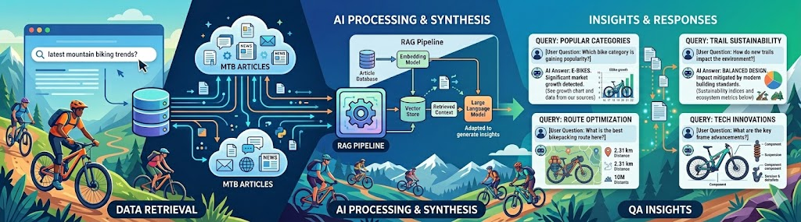
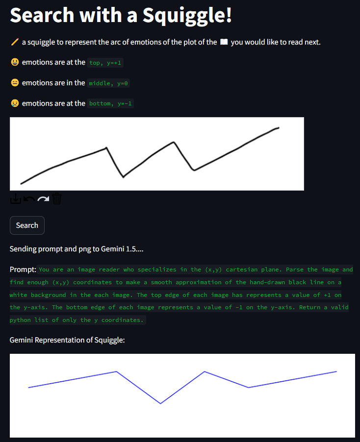
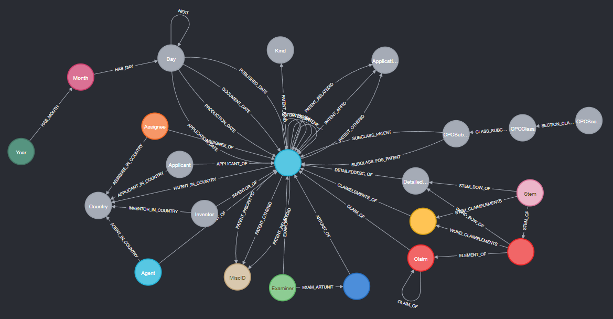
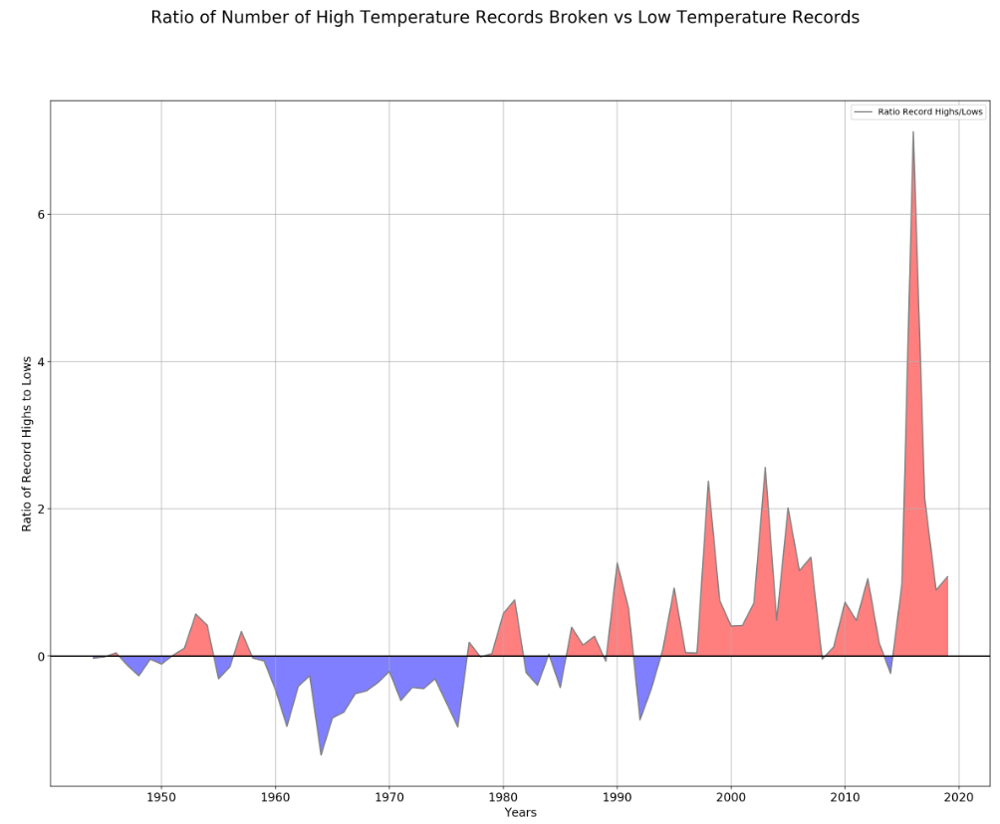

# Personal Projects :computer:

A collection of experiments, hackathons, and learning adventures!
From RAG-powered bike data explorers to emotional AI journey through classic literature, these projects represent my passion for exploring cutting-edge technology while making things fun and accessible.

Whether I'm competing in hackathons, wrestling with graph databases, or solving puzzle challenges like Advent of Code, each project teaches me something new about the ever-evolving world of data science and artificial intelligence.

---

## Simple RAG example

🚴‍♂️ **Dive into mountain bike trends!** Check out this [github repo](https://github.com/legolego/BikeScraping){target="_blank"} featuring an exciting RAG (Retrieval Augmented Generation) project! We built a cool notebook-based system that scrapes mountain bike data, stores it in Chroma vector database, and uses reciprocal rank to find the best matches. The results get fed into an open source LLM for those super interesting insights about your favorite two-wheelers!

## Gut-Emotions for MHacks
[](https://gut-emotions-mhacks.streamlit.app){target="_blank"}
This Streamlit app was our entry into [MHacks 16](https://safe-banon-80d.notion.site/Hacker-Guide-079b584c6deb446e88c53712dc0f9ecb){target="_blank"} in Ann Arbor, where we explored the fascinating intersection of generative AI and literary analysis. Leveraging Google Gemini 1.5's massive 1 million token context window, we processed complete classic novels from Project Gutenberg to extract emotional profiles and sentiment trajectories throughout entire works.

The concept was elegantly simple yet ambitious: represent an ideal reading experience as a drawn squiggle capturing the desired emotional journey (from heart-pounding thrillers to bittersweet romances), then find books whose emotional arcs best matched the drawing. While Gemini initially struggled to interpret hand-drawn input directly, we adapted by using OCR + PIL preprocessing for squiggle analysis.

The result? A unique search interface where you sketch your mood and discover literature matching that emotional fingerprint!

Source code: [GitHub repository](https://github.com/legolego/GutEmotions){target="_blank"}

---

## Patent search engine in Neo4j

Built with Neo4j's powerful graph capabilities, this search engine demonstrates the elegance of traversing interconnected relationships between inventors, assignees, citations, and claims. The database contains nearly one million patents loaded directly from [USPTO bulk data exports](https://developer.uspto.gov/product/patent-grant-full-text-dataxml){target="_blank"}, enabling complex queries like "find all patents citing this one," "who else works with this inventor?" or "what's the evolution of technology in this field?" Graph databases shine when relationships matter, and patent analysis is pure relationship territory.

---

## This Retype site
```c++
input: ./retype_src
output: C:/gitProjects/legolego.github.io
url: https://legolego.github.io/
cname: false

```
A simple demonstration that you can build beautiful static websites with minimal setup using [Retype](https://retype.com/){target="_blank"}. This site showcases how powerful documentation can be created entirely with Markdown - no complex frameworks required. The navigation is built-in and automatically generated based on file ordering.

---

## Temperature Records over time
[](https://github.com/legolego/WeatherRecords)
My first real adventure into data analysis with Jupyter notebooks! 📈 I wanted to answer a deceptively simple question: how often do extreme temperature records get broken? The methodology was straightforward: download decades of historical weather data, calculate the probability of new record highs and lows each year, then visualize the trends over time.

The results were eye-opening. You can see in the visualization whether recent years have been unusually active with record-breaking temperatures or if we're back to normal variability. Climate change enthusiasts and skeptics alike can look at the raw data for themselves.

Full analysis and interactive notebook: [GitHub repo](https://github.com/legolego/WeatherRecords){target="_blank"}

---

## Advent of Code Attempts
```python
sum = 0
for group in Lines01[:]:
    group = group.split('\n')
    sets = [set(x) for x in group]
    #print(set.intersection(*sets))
    sum += len(set.intersection(*sets))
```
The Advent of Code has been a yearly rite since ~2018! 🎄 These challenges combine clever algorithms, regex gymnastics, and creative problem-solving in Python. Each day presents a new puzzle inspired by real-world scenarios (navigation, cryptography, simulation games), forcing you to think outside the box. The code snippets here show my approach to set theory problems, but every year I tackle hundreds of lines worth across both days.

My [full collection of solutions](https://github.com/legolego/adventofcode2020){target="_blank"} from that active competing year - a good time capsule showing how much I've learned since then! (And yes, I still compete occasionally.)

---

## PyWekaBayes

```python
# Choose trained Weka BIFXML file
xmlfile = "D:/weka/iris.bif"    # created with BayesNet, MaxNrParents=2, BIFXML file
bifreader = JavaObject(JavaObject.new_instance("weka.classifiers.bayes.net.BIFReader"))
editable = Classifier(jobject=javbridge.make_instance(
                "weka/classifiers/bayes/net/EditableBayesNet",
                "(Lweka/classifiers/bayes/net/BIFReader;)V",
                bifreader.jwrapper.processFile(xmlfile)))

# We need to calculate the margins of all the attributes
marginCalc = JavaObject(JavaObject.new_instance("weka.classifiers.bayes.net.MarginCalculator"))
marginCalc.jwrapper.calcMargins(editable.jobject)

marginCalcNoEvidence = Serial.deepcopy(marginCalc)    # could maybe get by without this, just use marginCalc()
```

This project explores Python's Java Bridge capabilities to call Weka's Bayesian Network classifiers directly. Using Weka's BIFXML format - a compact XML representation of Bayesian networks created in the Weka GUI Chooser - we load trained models and compute attribute margins (Bayesian probabilities). This demonstrates how Python can leverage existing Java ML libraries without rewriting algorithms from scratch.

The [Weka Google Groups discussion](https://groups.google.com/g/python-weka-wrapper/c/qF4vw_6sqAA/m/EmqTph1NAAAJ){target="_blank"} offers additional insights into building Bayesian networks with this approach.