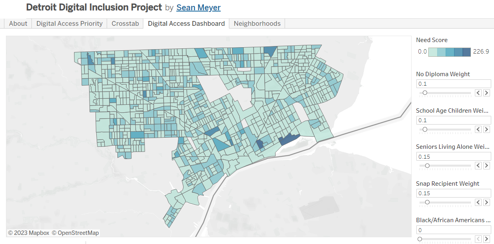
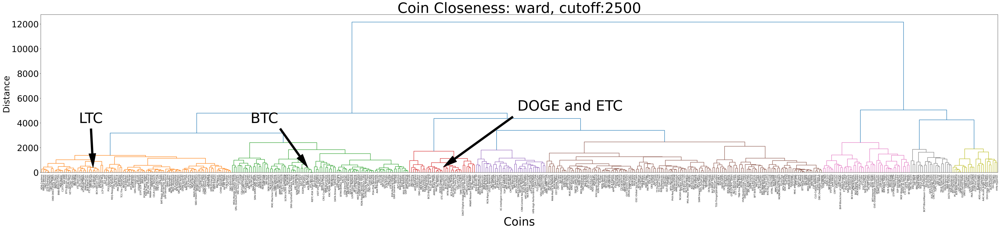
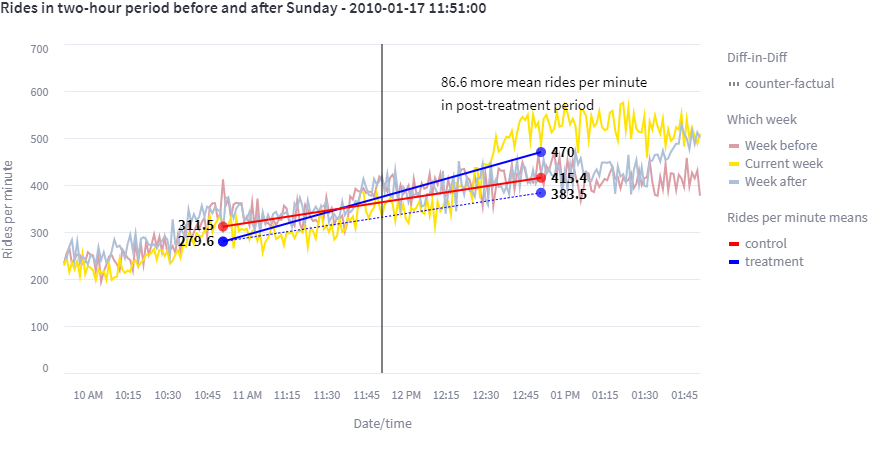

# University Projects :mortar_board:

These are projects completed while studying in the [University of Michigan Masters of Applied Data Science (MADS)](https://www.si.umich.edu/programs/master-applied-data-science) program.

---
## Detroit Digital Inclusion Project

[Michigan Institute for Data Science (MIDAS)](https://midas.umich.edu/detroit-digital-inclusion/) project where we were asked to study Detroit demographic data to find a way to prioritize which areas of Detroit were in most need of having internet. A [Tableau Dashboard](https://public.tableau.com/app/profile/sean.meyer1241/viz/DetroitDigitalInclusionProject/DigitalAccessPriority) was created to allow the user to weigh different characteristics in order to see how prioritization would change.

---
## Capstone

This was a project with the goal of doing an analysis on the combination of at least two data sets, rain and taxi rides in New York City. We also had a goal of using differences in differences to try to show the effects of rain on the number of taxi rides taken.

There is a Streamlit [version](https://mads-698-capstone-next-big-thing.streamlit.app) with all code [here](https://github.com/legolego/MADS_698_Capstone).

---

## Milestone II

There were two tasks in this project, both a supervised and unsupervised learing analysis. We decided to try to do next-day price prediction for the supervised learning part because it was a simpler goal for us to understand. For the unsupervised learning part of the project, we wanted to see if we could find families of coins whose prices tend to move together. This was accomplished by finding similar price movement through dynamic time warping and clustering, with the result being quite reasonable.

There is a Streamlit [version](https://mads-695-milestone2-crypto-prediction.streamlit.app) with all code [here](https://github.com/legolego/MADS695).

---

## Milestone I

This was a project with the goal of doing an analysis on the combination of at least two data sets, rain and taxi rides in New York City. We also had a goal of using differences in differences to try to show the effects of rain on the number of taxi rides taken.

There is a Streamlit [version](https://mads-592-milestone1-taxi-weather.streamlit.app) with all code [here](https://github.com/legolego/milestone_1_streamlit).

---

## Test Deepnote to Streamlit

This is a mostly empty example project to show how to code on Deepnote, connect through github, and have a site hosted on Streamlit. A little bit of code specific to Deepnote that makes things more convenient are included.

There is a Streamlit [version](https://deepnote-to-stlit-comm-cloud.streamlit.app) with all code [here](https://github.com/legolego/Streamlit_demo).