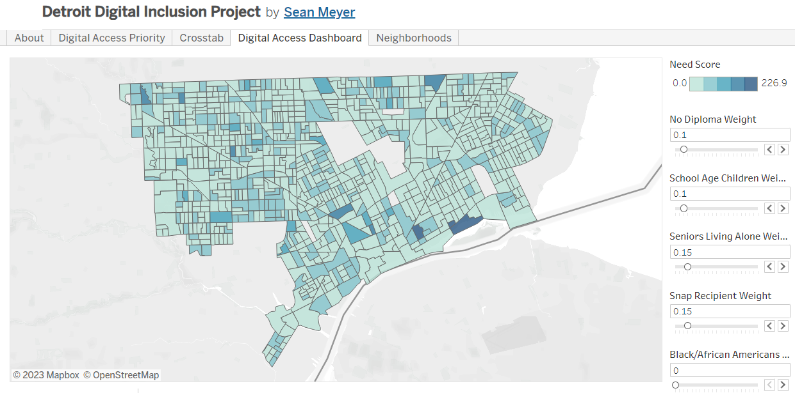
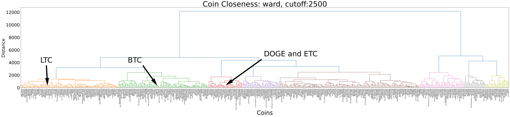
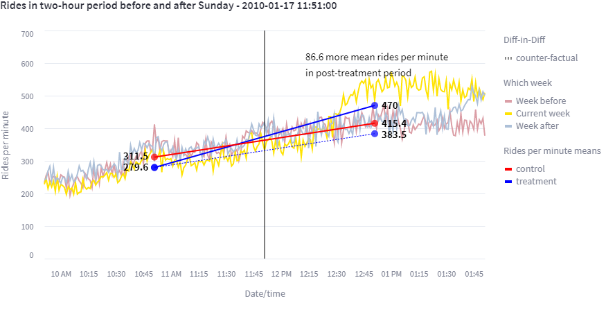

# University Projects :mortar_board:

These projects were developed during my time in the [University of Michigan Masters of Applied Data Science (MADS)](https://www.si.umich.edu/programs/master-applied-data-science){target="_blank"} program. From demographic analyses tackling Detroit's digital divide to cryptocurrency clustering experiments and weather-dependent mobility studies, each assignment pushed me to apply cutting-edge data science techniques to real-world problems.

Whether working with geographic information systems, time-series analysis, or building interactive visualizations, these projects represent the foundation of skills I use today — from mastering statistical inference to communicating insights through compelling dashboards. Dive into the Streamlit apps below and explore how academic coursework transformed into practical data science practice!

---
## Detroit Digital Inclusion Project
{target="_blank"}
This MIDAS initiative tackled a critical urban challenge: mapping digital access gaps in Detroit. Using demographic and infrastructure data, we identified neighborhoods most vulnerable to the "digital divide" — essential for effective policy decisions around broadband expansion.

The interactive [Tableau dashboard](https://public.tableau.com/app/profile/sean.meyer1241/viz/DetroitDigitalInclusionProject/DigitalAccessPriority){target="_blank"} allows stakeholders to prioritize interventions by weighting factors like income levels, age demographics, and existing infrastructure. Whether you're a city planner, community organizer, or researcher concerned with equity in technology access, this visualization makes complex spatial data actionable.

---
## Capstone: Weather & Urban Mobility Analysis
{target="_blank"}
Our final project combined NYC taxi trip data with weather information to quantify how rain impacts urban mobility patterns. Using difference-in-differences methodology, we isolated the causal effect of precipitation on ridership — controlling for day-of-week effects and other confounding variables.

The analysis reveals fascinating behavioral insights: New Yorkers reduce trips significantly in rain but still travel more than usual compared to dry conditions (showing weather-dependent baseline demand shifts). The [Streamlit app](https://mads-698-capstone-next-big-thing.streamlit.app){target="_blank"} lets you toggle variables and see how different weather conditions reshape the city's transportation ecosystem. Full code: [GitHub repository](https://github.com/legolego/MADS_698_Capstone){target="_blank"}.

---

## Milestone II: Cryptocurrency Analysis
{target="_blank"}
Course 695 challenged us to combine supervised and unsupervised learning approaches. My project explored cryptocurrency markets from two angles:

**Supervised**: Next-day price prediction using historical patterns (a practical, if ambitious, forecasting exercise).

**Unsupervised**: Discovering "crypto families" — groups of coins whose prices move together. Using dynamic time warping to measure similarity in price trajectories despite different absolute values, then clustering coins into communities with shared behavior.

The resulting dendrogram reveals interesting market microstructure: smaller altcoins often cluster by ecosystem or use case, while large caps like BTC/ETH form their own clusters. Full interactive app and code: [Streamlit demo](https://mads-695-milestone2-crypto-prediction.streamlit.app){target="_blank"} | [GitHub repo](https://github.com/legolego/MADS695){target="_blank"}.

---

## Milestone I: Rain & Taxi Mobility
{target="_blank"}
Course 592 introduced us to difference-in-differences (DiD) — a causal inference workhorse in economics and social science. My first DiD application measured how weather affects NYC urban mobility.

By comparing pre/post rain periods while controlling for time trends, the analysis isolates the causal impact of precipitation on taxi demand. The results show that New Yorkers adapt their travel behavior to weather conditions: fewer trips overall, but still significant activity compared to a hypothetical dry-day baseline.

Explore the visualization to see how different weather intensities shift mobility patterns. Complete notebook and Streamlit app: [GitHub repo](https://github.com/legolego/milestone_1_streamlit){target="_blank"} | [Interactive demo](https://mads-592-milestone1-taxi-weather.streamlit.app){target="_blank"}.

---

## Test Deepnote to Streamlit
{target="_blank"}
A lightweight demonstration of modern data science workflows: cloud-based coding in Deepnote notebooks, version control via GitHub, and instant deployment as a Streamlit web app.

This setup shows how you can collaborate on data projects online while maintaining reproducibility. The included templates demonstrate convenient Deepnote features that streamline the development process.

Want to try it yourself? [View the live demo](https://deepnote-to-stlit-comm-cloud.streamlit.app){target="_blank"} | [GitHub repository](https://github.com/legolego/Streamlit_demo){target="_blank"}.
