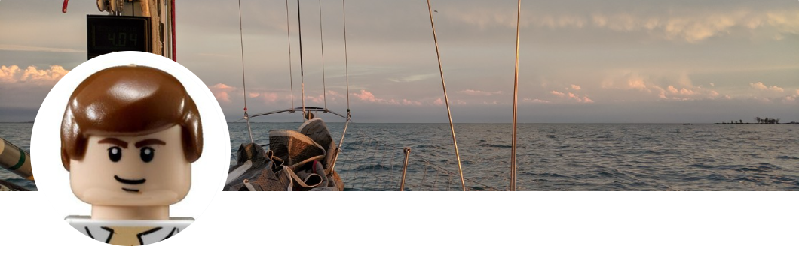

# Hello! :wave:

I'm a data scientist turned educator, bridging the gap between complex algorithms and real-world applications. By day, I architect solutions at DXC Technologies; by day, I mentor students through the rigors of the MADS program at Michigan.

My passion lies in taking unfamiliar concepts—whether it's graph databases with millions of nodes or the emotional arcs hidden in classic literature—and making them accessible to others.

This is a slightly curated site for my projects that should be easier to navigate than my GitHub [repository](https://github.com/legolego){target="_blank"}.

More about my work experience can be found on [LinkedIn](https://www.linkedin.com/in/olegnikolsky/){target="_blank"}

## :boat: Areas of Interest :bike:

||| :thought_balloon: NLP

Natural Language Processing, or extracting data from text with something like BERT vectors.

||| :hammer_and_wrench: Model building

Data wrangling, feature engineering, and tuning/testing to build a reliable model.

||| :bar_chart: Visualizations

Creating clear charts that enhance understanding.

|||

||| :spider_web: Graph Databases

I've created a Neo4j database with over 1 million patents and claims.

||| :desktop_computer: CI/CD

Continuous Integration/Continuous Development experience with Jenkins, GitHub, and Microsoft Team Foundation/DevOps Server

||| :alembic: Invention

Brainstorming new ideas and creating prototypes

|||

## Patents :toolbox:

Some patents I helped create:

[US10175779B2](https://patents.google.com/patent/US10175779B2/en){target="_blank"} - Discrete cursor movement based on touch input 
[US11256831B2](https://patents.google.com/patent/US11256831B2/en){target="_blank"} - System and method for secure electric power delivery

And other patent applications I've been a part of:

[WO2017131728](https://patents.google.com/patent/WO2017131728A1/en){target="_blank"} - Cursor movement based on context 
[US20170336881A1 ](https://patents.google.com/patent/US20170336881A1/en){target="_blank"} - Discrete cursor movement based on touch input region 
[US20170220223A1](https://patents.google.com/patent/US20170220223A1/en){target="_blank"} - Generate Touch Input Signature for Discrete Cursor Movement
